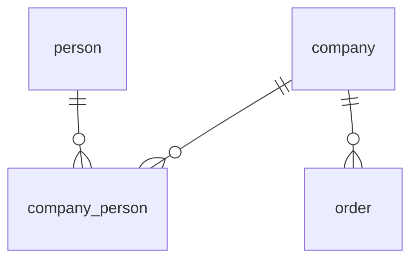
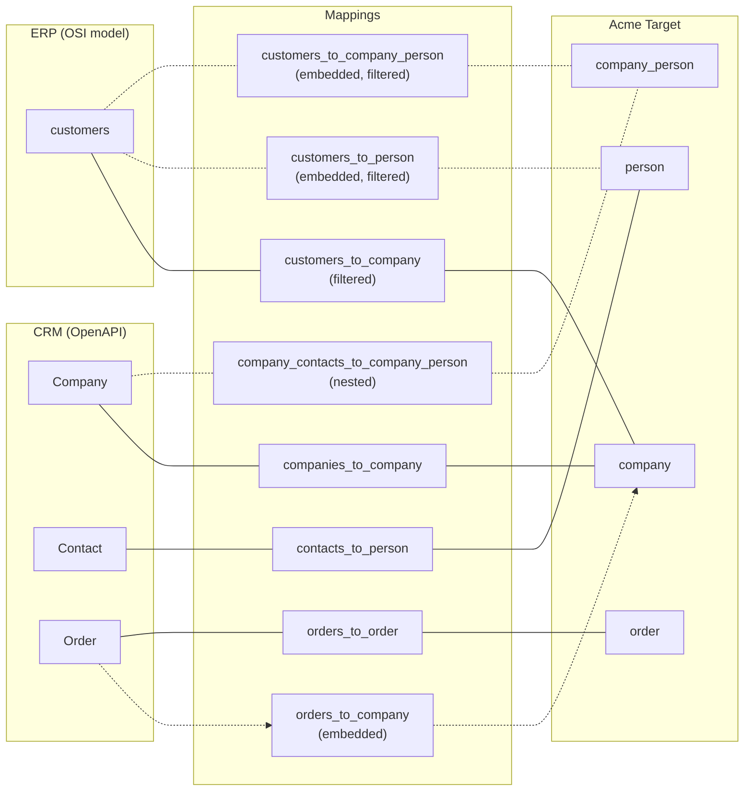

# Example: Company + Person + Order Merge

Two sources contribute to canonical company and person datasets.

## Sources

| Source | Type | File |
|--------|------|------|
| **CRM** | OpenAPI | [crm-openapi.yaml](crm-openapi.yaml) |
| **ERP** | OSI model | [model-erp.yaml](model-erp.yaml) |

## Target

The canonical **Acme** model ([model-acme.yaml](model-acme.yaml)) has four datasets: `company`, `person`, `company_person` (association/link table), and `order`.

### ER Diagram

## Mappings

Both sources map `name` and `account` into the shared `company` dataset.
They also contribute a canonical `is_customer` flag:
- ERP sets `is_customer` to a static `TRUE`.
- CRM maps `customer_toggle` to `is_customer`.
- CRM `Order` records assign a customer role by setting `is_customer = TRUE` as a static value.

ERP reverse mapping only applies to rows where `is_customer = TRUE`.
Companies are matched across sources by their customer account number (`account_number` in both CRM and ERP).
Entity linking: companies are linked by `account`, persons are linked by `email`.

For person data:
- CRM provides standalone `Contact` records. Contact associations are deeply nested on the `Company` object: each company has a `contact_associations` array of contacts, and each contact has a `roles` array with `relation_type`. The mapping uses `source_path: contact_associations.roles` (deep nesting) with `parent_fields` to pull the company `id` from the root and `contact_id` from the intermediate `contact_associations` level.
- CRM provides `firstname` + `lastname`.
- ERP provides only embedded `fullname` for person names.
- ERP provides an embedded primary contact inside each customer row, mapped to `company_person` with a static `relation_type = 'primary-contact'`.
- ERP reverse on `company_person` is filtered to `relation_type = 'primary-contact'` so only that role flows back.

## Resolution

| Field | Strategy | Winner |
|-------|----------|--------|
| name | COALESCE | ERP (priority 1) |
| account | COLLECT (link) | Entity linking field |
| is_customer | COALESCE | ERP static TRUE, CRM toggle, or CRM order existence |

`person` resolution:

| Field | Strategy | Winner |
|-------|----------|--------|
| firstname | LAST_MODIFIED (atomic group) | Group winner |
| lastname | LAST_MODIFIED (atomic group) | Group winner |
| fullname | LAST_MODIFIED (atomic group) | Group winner |
| email | COLLECT (link) | Entity linking field |

`company_person` resolution:

| Field | Strategy | Winner |
|-------|----------|--------|
| relation_type | COLLECT | All relation types retained |

`order` dataset is currently sourced only from CRM (`orders_to_order`), so no cross-source resolution is required.

## Files

| File | Description |
|------|-------------|
| [crm-openapi.yaml](crm-openapi.yaml) | CRM OpenAPI schema |
| [model-erp.yaml](model-erp.yaml) | ERP source model (customers + embedded contact projection with relationship) |
| [model-acme.yaml](model-acme.yaml) | Acme target model |
| [mapping-crm.yaml](mapping-crm.yaml) | CRM → company + person + company_person + order |
| [mapping-erp.yaml](mapping-erp.yaml) | ERP → company + embedded person/company_person, reverse filtered |
| [resolution-acme.yaml](resolution-acme.yaml) | Company + person + company_person resolution rules |
