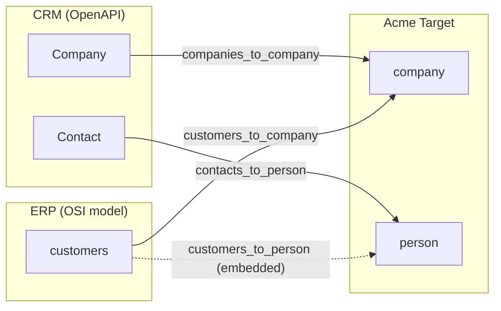

# Example: Company + Person Merge

Two sources contribute to canonical company and person datasets.

## Sources

| Source | Type | File |
|--------|------|------|
| **CRM** | OpenAPI | [crm-openapi.yaml](crm-openapi.yaml) |
| **ERP** | OSI model | [model-erp.yaml](model-erp.yaml) |

## Target

The canonical **Acme** model ([model-acme.yaml](model-acme.yaml)) has two datasets: `company` and `person`.

## Mappings

Both sources map `name`, `email`, and `account` into the shared `company` dataset.
They also contribute a canonical `is_customer` flag:
- ERP sets `is_customer` to a static `TRUE`.
- CRM maps `customer_toggle` to `is_customer`.

ERP reverse mapping only applies to rows where `is_customer = TRUE`.
Companies are matched across sources by their customer account number (`account_number` in both CRM and ERP).
Entity linking uses a tuple match on `(account, email)`.

For person data:
- CRM provides standalone `Contact` records.
- ERP provides an embedded primary contact inside each customer row.

## Resolution

| Field | Strategy | Winner |
|-------|----------|--------|
| name | COALESCE | ERP (priority 1) |
| email | LAST_MODIFIED | Most recently updated |
| account | COALESCE | First non-null |
| is_customer | COALESCE | ERP static TRUE, otherwise CRM toggle |

`person` resolution:

| Field | Strategy | Winner |
|-------|----------|--------|
| person_id | COALESCE | First non-null |
| company_id | COALESCE | First non-null |
| name | COALESCE | First non-null |
| email | LAST_MODIFIED | Most recently updated |

## Files

| File | Description |
|------|-------------|
| [crm-openapi.yaml](crm-openapi.yaml) | CRM OpenAPI schema |
| [model-erp.yaml](model-erp.yaml) | ERP source model (customers + embedded contact projection with relationship) |
| [model-acme.yaml](model-acme.yaml) | Acme target model |
| [mapping-crm.yaml](mapping-crm.yaml) | CRM → company + person (includes `Contact` → `person`) |
| [mapping-erp.yaml](mapping-erp.yaml) | ERP → company + embedded person contact, reverse filtered to customers |
| [resolution-acme.yaml](resolution-acme.yaml) | Company + person resolution rules |
