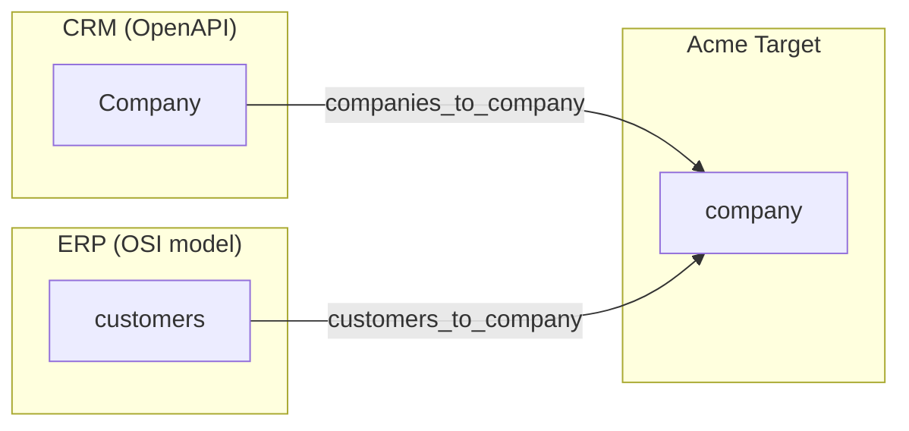

# Example: Company Merge

Two sources contribute to a single canonical company dataset.

## Sources

| Source | Type | File |
|--------|------|------|
| **CRM** | OpenAPI | [crm-openapi.yaml](crm-openapi.yaml) |
| **ERP** | OSI model | [model-erp.yaml](model-erp.yaml) |

## Target

The canonical **Acme** model ([model-acme.yaml](model-acme.yaml)) has one dataset: `company`.

## Mappings

Both sources map `name`, `email`, and `account` into the shared `company` dataset.
Companies are matched across sources by their customer account number (`account_number` in both CRM and ERP).

## Resolution

| Field | Strategy | Winner |
|-------|----------|--------|
| name | COALESCE | ERP (priority 1) |
| email | LAST_MODIFIED | Most recently updated |
| account | COALESCE | First non-null |

## Files

| File | Description |
|------|-------------|
| [crm-openapi.yaml](crm-openapi.yaml) | CRM OpenAPI schema |
| [model-erp.yaml](model-erp.yaml) | ERP source model |
| [model-acme.yaml](model-acme.yaml) | Acme target model |
| [mapping-crm.yaml](mapping-crm.yaml) | CRM → company (name priority 2, email LAST_MODIFIED) |
| [mapping-erp.yaml](mapping-erp.yaml) | ERP → company (name priority 1, email LAST_MODIFIED) |
| [resolution-acme.yaml](resolution-acme.yaml) | COALESCE name + account, LAST_MODIFIED email |
